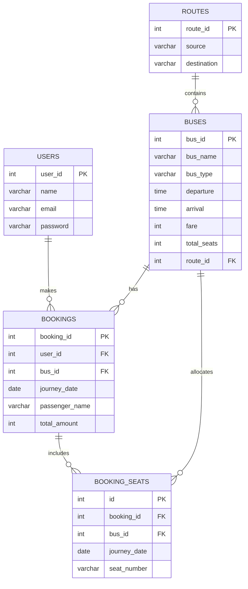

# ER Diagram

```mermaid
erDiagram
    USERS ||--o{ BOOKINGS : makes
    ROUTES ||--o{ BUSES : contains
    BUSES ||--o{ BOOKINGS : has
    BOOKINGS ||--o{ BOOKING_SEATS : includes
    BUSES ||--o{ BOOKING_SEATS : allocates

    USERS {
        int user_id PK
        varchar name
        varchar email
        varchar password
    }
    ROUTES {
        int route_id PK
        varchar source
        varchar destination
    }
    BUSES {
        int bus_id PK
        varchar bus_name
        varchar bus_type
        time departure
        time arrival
        int fare
        int total_seats
        int route_id FK
    }
    BOOKINGS {
        int booking_id PK
        int user_id FK
        int bus_id FK
        date journey_date
        varchar passenger_name
        int total_amount
    }
    BOOKING_SEATS {
        int id PK
        int booking_id FK
        int bus_id FK
        date journey_date
        varchar seat_number
    }
```
